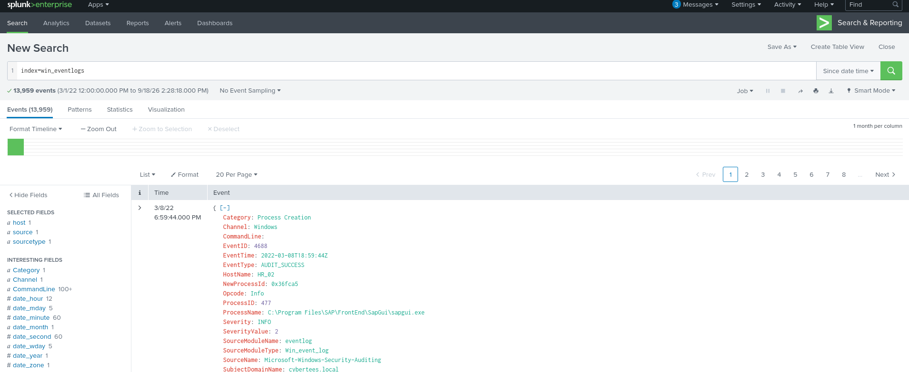
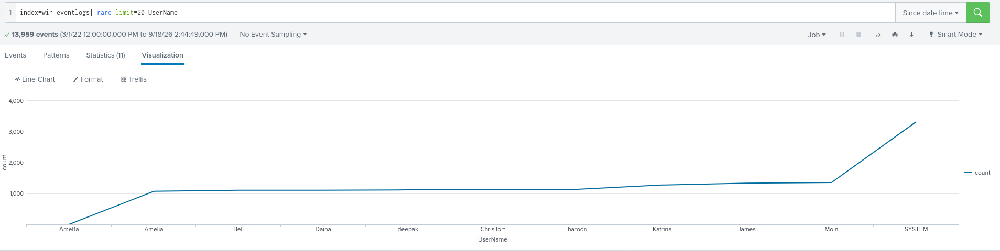
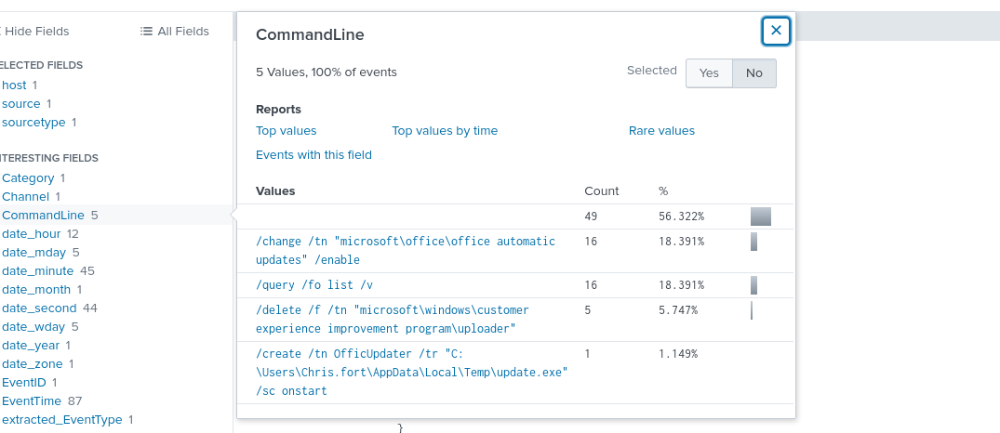
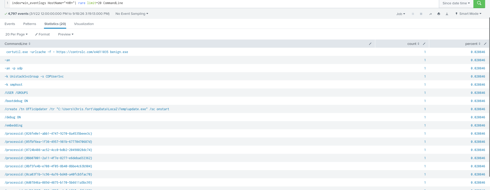
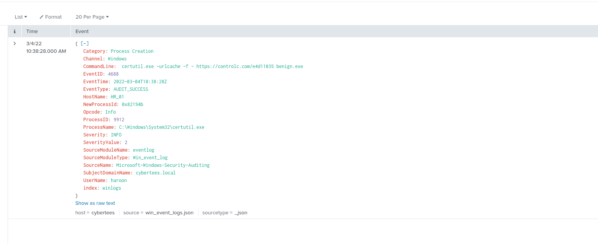
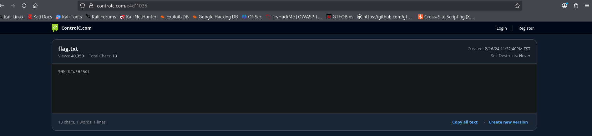

En esta habitación de Blue Team, se nos da un escenario en donde uno de los IDs de un cliente indico un potencial ejecución de proceso, indicando que uno de los hosts del departamento de HR fue comprometido, herramientas relacionadas a la recolección de información de red y tareas con horario fueron ejecutadas lo que confirmo la sospechosa, debido a los recursos limitados, solo se nos los logs de ejecución de proceso con el ID evento 4688, a partir de aquí tenemos que usar Splunk para descubrir lo que paso, como paso, quien lo hizo y responder a las preguntas de la habitación.

La primera pregunta pide la cantidad de logs desde Marzo del 2022, al acomodar dicha fecha en Splunk se muestra una cantidad de 13959

Cuantos logs se muestran desde el mes de Marzo 2022?
- 13595

La siguiente pregunta dice que hay una cuenta de impostor observada en los logs, al ver el campo de Usernames en Splunk, se ve que hay 11 valores, lo cual es raro ya que en la información de la habitación ya se nos da las cuentas de los diferentes empleados que son 9 y una de System que es de suponer la cuenta de admin, al filtrar este campo para mostrar los valores encontramos una cuenta de usuario intentando pasar desapercibido con el nombre de "Amel1a"

Cual es la cuenta de impostor observada en los logs?
- Amel1a

La siguiente pregunta pide encontrar el usuario de HR que fue observado ejecutando una scheduled task, al hacer el siguiente query en Splunk:

index=win_eventlogs EventID=4688 schtasks.exe

Y al observar los diferentes campos o fields en Splunk, se ve que hay un Commandline ejecutando una scheduled task con un ejecutable sospechoso desde la carpeta Temp, en ese mismo comando se puede ver el usuario que lo ejecuto.

Cual fue el usuario de HR que fue observado ejecutando una scheduled task?
- Chris.fort

La siguiente pregunta pide encontrar que usuario de HR utilizo un LOLBIN para descargar un payload de un servicio para compartir archivos, un LOLBIN es un binario legítimo, firmado y preinstalado en un sistema operativo que los atacantes reutilizan con fines maliciosos, la palabra viene del inglés **Living off the Land Binary**, esto significa aprovechar los recursos que ya están en el sistema.

De este tipo de binarios hay muchos, entonces buscar que binario fue utilizado exactamente seria algo tardado, para esto se utilizo el siguiente query:

index=win_eventlogs HostName="*HR*"| rare limit=20 CommandLine

Lo que hace esto es mostrar los commandline con una cantidad pequeña de eventos, utilizados por los HostNames que tengan un HR.

De esta manera se pudo encontrar que LOLBIN fue usado exactamente y que usuario de HR fue el que descargo el payload, ademas, con el evento exacto encontrado se puede responder a las siguientes preguntas:

Que usuario de HR utilizo un LOLBIN para descargar un payload de un servicio para compartir archivos?
- haroon
 
Para bypasear los controles de seguridad, que lolbin fue usado para descargar el payload de internet?
- certutil.exe

Cual fue la fecha en la que este binario fue ejecutado por el host infectado?
- 2022-03-04

Que servicio third-party fue accedido para descargar el paylaod malicioso?
- controlc.com

Cual es el nombre del archivo que fue guardado en la maquina host desde el servidor C2 durante la fase de post-explotación?
- benign.exe

En la imagen de arriba donde se muestra el evento, se puede ver una URL, al entrar a esta URL se encuentra un txt que contiene la flag para responder a la siguiente pregunta:

- THM{KJ&*H^B0}

Y la ultima pregunta pide la URL a la que el host infectado se conecto, dicha URL que la que se acaba de utilizar para encontrar la flag

- https:// controlc.com/ e4d11035

