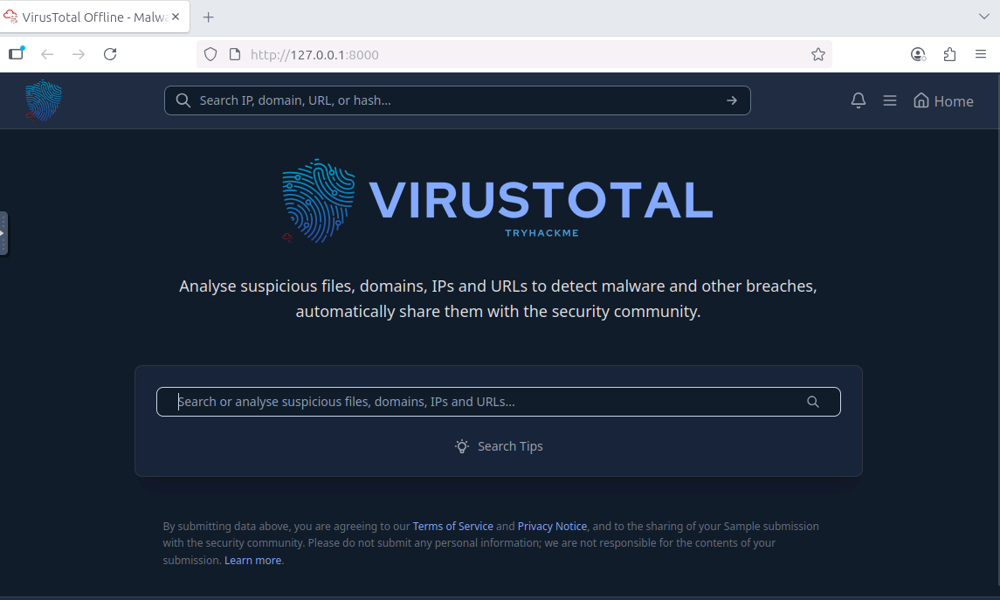
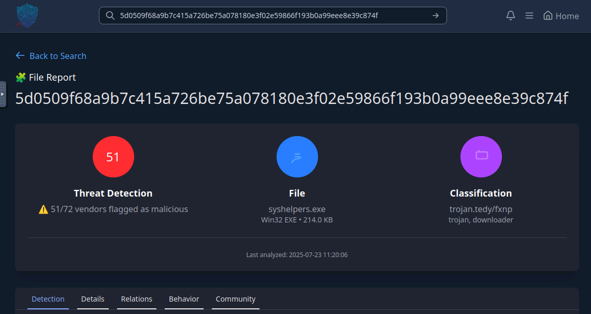
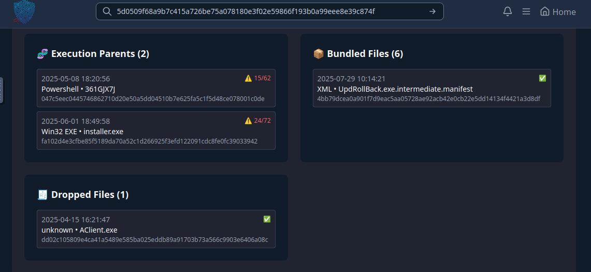
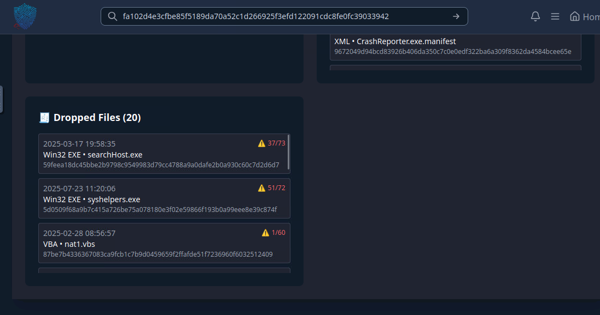
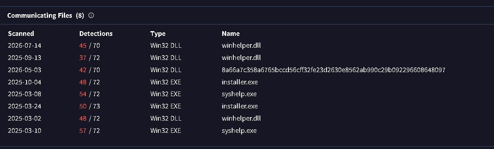
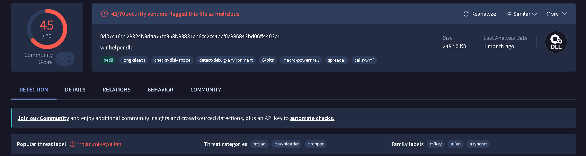
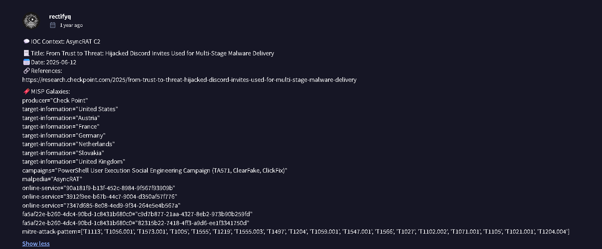
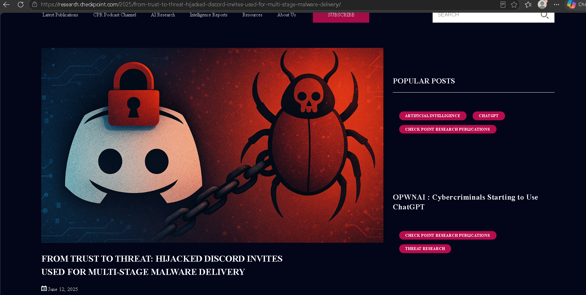
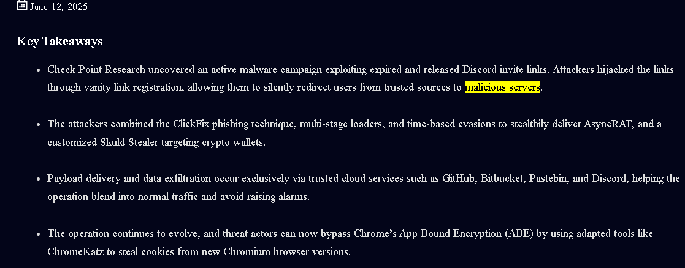
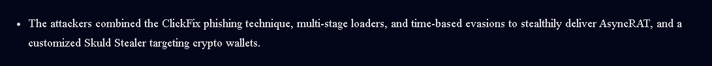

En esta maquina se toma el rol de un analista de Nivel 1 o L1, con el objetivo de analizar y encontrar toda la información posible de una IP y una hash SHA256 aplicando técnicas y herramientas de inteligencia de amenazas aprendidas durante habitaciones anteriores, los artefactos que da el desafío son:

Flagged IP: 101[.]99[.]76[.]120
Flagged SHA256 hash: 5d0509f68a9b7c415a726be75a078180e3f02e59866f193b0a99eee8e39c874f

Al iniciar la maquina virtual del desafío se le da al usuario una herramienta llamada "TryDetectThis2.0" una versión offline de VirusTotal hecha para poder realizar la inteligencia de amenazas durante el desafío, la primera pregunta es:

En la imagen se puede ver que al analizar el hash del archivo, muestra cuando antivirus lo detectaron como malicioso, el nombre del archivo y la clasificación de este, dando con la respuesta y ademas en el mismo lugar esta la respuesta de la siguiente pregunta.

Cual es el nombre del archivo asociado al hash SHA256 encontrado?
- syshelpers.exe

Cual es el tipo de archivo asociado al hash SHA256 encontrado?
- WIN32 EXE

Al ir al apartado de relaciones en la herramienta TryDetectThis2.0, se encuentra toda la información relacionada a que dominios contacta el archivo/malware, IPs contactadas, archivo dejados, archivo empaquetados y el apartado para responder a esta pregunta, execution parents, el hash analizado cuenta con 2 execution parents, Powershell ocurriendo a las 18:20 y WIN32 EXE ocurriendo 18:49 días después del Powershell, el desafío de Invite Only sugiere guardar los hashes de estos archivos ya que se necesitaran mas adelante.

361GJX7J: 047c5eec0445746862710d20e50a5dd04510b7e625fa5c1f5d48ce078001c0de
WIN32 EXE: fa102d4e3cfbe85f5189da70a52c1d266925f3efd122091cdc8fe0fc39033942
AClient.exe: dd02c105809e4ca41a5489e585ba025eddb89a91703b73a566c9903e6406a08c

Cuales son los execution parents del hash? listar de forma cronológica usando una coma como separador

- 361GJX7J,installer.exe

Para responder a la siguiente pregunta hay que analizar el segundo hash en la pregunta 3 y encontrar los 4 archivos maliciosos dejados por el archivo según como aparezcan(Arriba hacia abajo)

Nota: la pregunta pide listar los archivos maliciosos, los archivos que cuentan con un check verde no son considerados maliciosos y no cuentan para la respuesta.

Cuales son los 4 archivos maliciosos dejados por el segundo hash de la pregunta 3?
- searchhost.exe,syshelpers.exe,nat.vbs,runsys.vbs

---

Durante esta sección se han investigado los hashes, ahora hay que analizar todo lo relacionado a la IP encontrada al principio en el caso del desafío, la siguiente pregunta pide encontrar la familia de malware de los archivos analizados en la IP.

Al intentar analizar esta IP en la herramienta offline del desafío no dio ningún resultado útil, entonces a partir de aquí se sigue respondiendo con ayuda de la herramienta online VirusTotal ya que se va a necesitar para responder varias preguntas

Al ver los reportes de varios de los archivos a los que la IP se comunica se ve una etiqueta que se repite en varios de estos reportes, la cual es Ayncrat, siendo esa la respuesta de la siguiente pregunta.

Que familia de malware interconecta los archivos a los que la IP se comunica?

- Asyncrat

La siguiente pregunta pide investigar el titulo del reporte original donde los indicadores de compromiso se mencionaron, la pregunta recomienda usar Google pero esto no es necesario ya que en el reporte de VirusTotal de la IP en el apartado de comunidad se puede encontrar dicho reporte.

- From Trust to Threat: Hijacked Discord Invites Used for Multi-Stage Malware Delivery

A partir de aquí, las preguntas hechas en el desafío se responderán mediante el reporte encontrado.

Que herramienta los atacantes usaron para robar las cookies del navegador web Google Chrome?

- ChromeKatz

Que técnica phishing usaron los atacantes?

- ClickFix

Cual es el nombre de la plataforma que usaron para luego redireccionar a sus servidores maliciosos?

La respuesta de esta pregunta es algo obvia al ver las imágenes usadas en el reporte, pero la respuesta es Discord