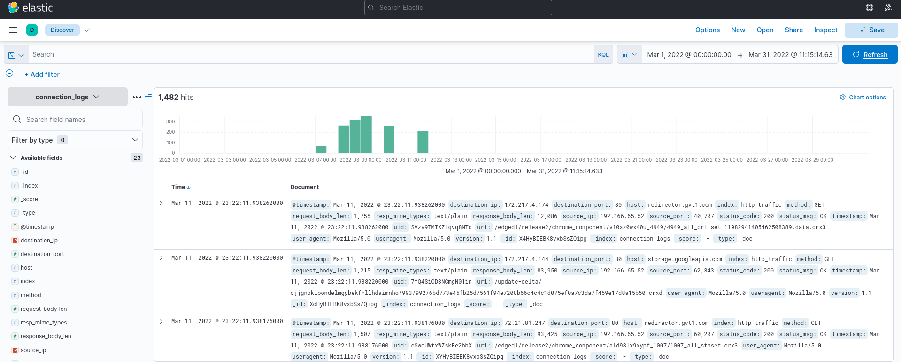
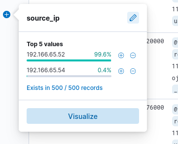
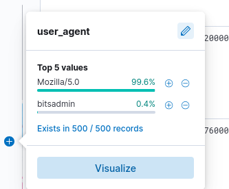
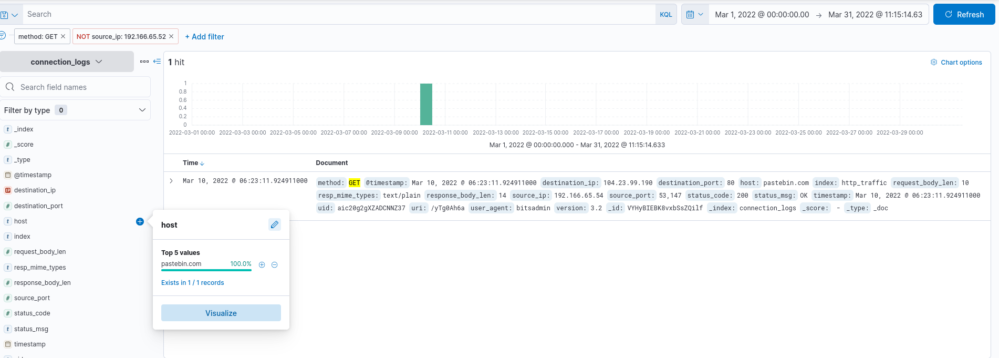
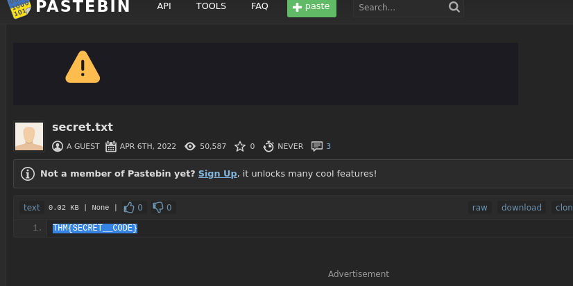
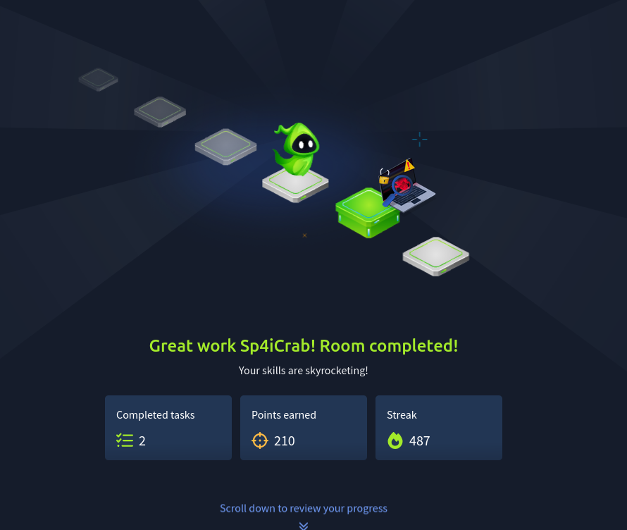

En esta habitación es un desafío simple donde se toma el rol de un analista de SOC investigando una alerta sobre una posible comunicación C2 en la plataforma Elastik

La primera pregunta pide la cantidad de total de eventos que hubieron en el mes de marzo del 2022

Como se puede ver en la imagen, al poner el rango de tiempo en marzo la plataforma muestra una cantidad de 1482 logs

Cuantos eventos fueron retornados en el mes de marzo 2022?

- 1482

La siguiente pregunta pide saber la IP asociada al usuario sospechoso en los logs, al analizar en campo de source_Ip se ven 2 IPs, una tiene mucha actividad en ese rango de tiempo mientras que la otra poca, uno pensaría que la IP con mas actividad seria la sospechosa,

pero al ir al campo de user_agents, se ven 2 herramientas, Mozilla y Bitsadmin

Mozilla es un navegador legitimo y podría ser usado por cualquiera pero Bitsadmin es una herramienta de línea de comandos de Windows que sirve para crear, descargar y cargar archivos en segundo plano, siendo algo mas raro que fuera usado en este escenario, al ver los logs relacionados a esta herramienta se ve que la segunda IP de la imagen de arriba es la que esta relacionada a dicha herramienta, con esto se responde a dos de las preguntas del desafío.

Cual es la IP asociada con el usuario sospechoso en los logs?

- 192.166.65.54

Cual fue el binario legitimo de Windows utilizado por el atacante para descargar un archivo del servidor C2

- Bitsadmin

La siguiente pregunta dice que la maquina infecta se conecto a un servicio popular para compartir archivos lo que también actuó como un servidor C2 usado por los atacantes, al ver los mismos logs donde se encontró Bitsadmin o usando campos específicos, se puede encontrar esta plataforma.

- pastebin.com

En este mismo log, se encuentra la respuesta de la siguiente pregunta, la cual pide saber la URL completa del C2 que infecto al host conectado

- pastebin.com/ yTg0Ah6a

La siguiente pregunta dice que un archivo fue accedido desde ese sitio, ya conseguimos la URL completa entonces solo queda entrar en esta y ver su contenido

Se ve que el archivo accedido fue un txt llamado secret y el contenido del mismo es la flag para responder a la ultima pregunta

