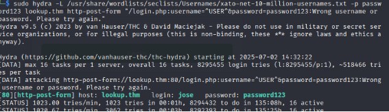

**Lookout THM**

Al hacer un escaneo de puertos utilizando nmap se encuentran solo 2 abiertos

22: SSH

80: HTTP versión Apache httpd 2.4.41 ubuntu 

Dentro de la pagina solo se encuentra un login el cual al dar datos incorrectos espera 3 segundos antes de volver a permitir al usuario intentar nuevamente.

Antes de enfocarse en el login, se utiliza la herramienta Gobuster para escanear por directorios que pudieran contener información útil

El escaneo no dio ningún resultado, posiblemente aun no se tenga que buscar directorios, entonces hay que seguir con el login, al probar inyecciones sql manuales y automáticas con SQLMAP no se consiguió nada de utilidad o información de ayuda con el login.

Dato a mencionar es que el mensaje genérico que aparece luego de ingresar datos en el login cambia dependiendo del usuario que se ingreso

Como se puede ver, al poner un nombre aleatorio en username este es el mensaje genérico que aparece, pero al ingresar el usuario ‘admin’ se consigue mensaje de error diferente, de esta forma se consigue un posible nombre de usuario a utilizar.

Con esto en mente, se utiliza la herramienta ‘Hydra’ para un ataque de fuerza bruta 

sudo hydra -v -l admin -P /usr/share/wordlists/rockyou.txt lookup.thm http-post-form "/login.php:username=admin&password=^PASS^:Wrong password. Please try again"

Al utilizar el siguiente comando con los parámetros establecidos para utilizar en un http-form, se consigue el siguiente resultado.

Se obtiene una contraseña, por lo que parecería suficiente probar con admin:password123 en el login, ¿verdad?

Al intentar iniciar sesión manualmente con admin:password123, el servidor devolvía el mensaje genérico:\
"Wrong username or password. Please try again."

Esto indicaba que, a pesar de que la contraseña era correcta, el nombre de usuario no lo era, lo curioso es que el sistema devolvía el mismo mensaje de error para cualquier otro usuario diferente de admin, incluso si la contraseña era válida.

Por esta razón, fue necesario realizar un segundo ataque de fuerza bruta, esta vez sobre el campo de usuario, utilizando password123 como contraseña fija.

Al ingresar dichas credenciales, se produce un error de conexión, en un principio se pensó que era un fallo de la máquina, pero al revisar la URL se notó una redirección al subdominio files.lookup.thm, el cual no estaba definido en /etc/hosts.

Al ingresar se ve una aplicación web de manejo y administración de archivos llamado ‘ElFinder’ el cual es un explorador de archivos de MacOS, se ven varios archivos con nombres interesantes como ‘root.txt’ o ‘admin.txt’ pero al ingresar a estos solo muestran palabras aleatorias, posiblemente algún sistema de encriptación para quienes no tengan permisos necesarios.

Al navegar por el explorador en busca de información se encuentra una versión, al buscar dicha versión en internet se encuentra una CVE, más en específico, la CVE- 2019-9194 relacionado a RCE o ejecución remota de codigo.

Al ejecutar el exploit encontrado y utilizar netcat escuchando en el puerto 5555 en otra terminal, se consigue una reverse shell como www-data, como este usuario prácticamente no tiene muchos permisos, al ir al directorio /home, se encuentra un usuario llamado ‘think’ el mismo que tiene un archivo dentro de ElFinder y ahí se encuentra la flag.txt, pero solo se puede abrir el .txt si somos el usuario think o root.

**find / -perm /4000 2>/dev/null**

Se utiliza este comando en busca de SUID’s para escalar privilegios que ayuden a encontrar la manera de ser usuario think o root

En esta búsqueda se encuentran uno llamado ‘pwm’ el ejecutarlo muestra lo siguiente:

Este SUID obtiene el ID del usuario que lo ejecuta y se dirige a su directorio /home en busca de un archivo oculto llamado .passwords, para analizarlo, se utiliza el comando strings sobre pwm, lo que permite observar las cadenas de texto utilizadas internamente por el programa y asi explicar su funcionamiento con ayuda de una inteligencia artificial.

Básicamente, pwm ejecuta el comando id y extrae información como el UID (User ID), GID (Group ID) y, especialmente, el nombre de usuario, que aparece entre paréntesis en la salida de id, a partir de ese nombre, construye una ruta hacia /home/usuario/.passwords y trata de leer el contenido del archivo, todo este proceso se realiza con permisos de root, ya que el binario tiene el bit SUID activado.

Con lo explicado anteriormente, se procede a engañar al pwm para que, en lugar de leer el ID del usuario que lo está ejecutando, ejecute un script que simula ser el usuario think, esto es relevante porque think es el usuario que posee la flag de user y además cuenta con un archivo .passwords en su directorio personal.

Mediante una serie de comandos, se crea un archivo llamado id dentro del directorio /tmp, aprovechando los permisos disponibles dentro del directorio, este script simula la salida del comando id para hacer creer a pwm que el usuario actual es think, luego, se modifica la variable de entorno PATH para que pwm ejecute el script falso, lo que permite acceder al archivo .passwords del usuario think.

Con todo este contenido dentro de .passwords, se copia en un txt para ser usado en hydra y hacer un ataque de fuerza bruta en contra del servicio ssh encontrado al principio.

Con esto hecho se logra conseguir la primera flag de user.txt, ahora solo falta encontrar la manera de escalar privilegios como root y completar la maquina,

Se ve como el usuario think tiene acceso a un binario llamado look.

Dicho binario puede leer el contenido de un archivo con permisos root, con esto en mente, simplemente se puede ejecutar el siguiente comando para conseguir el contenido de root.txt:\
\
sudo /usr/bin/look '' /root/root.txt

El comando look funciona de forma similar a grep, ya que permite buscar texto dentro de archivos, la diferencia principal es que look solo encuentra líneas que comienzan con el texto indicado, mientras que grep puede buscar coincidencias en cualquier parte de la línea, en este caso, se utilizó look con comillas vacías ('') como prefijo, lo que equivale a buscar “nada”, como todas las líneas de un archivo comienzan con una cadena vacía, esto provoca que look muestre todo el contenido del archivo, al ejecutarlo con sudo, fue posible usar este truco para leer el archivo protegido /root/root.txt y obtener la flag de root y completar la maquina Lookup.

**Nota:**

Se puede utilizar Look para conseguir el  id\_rsa de root de la misma manera en la que se obtuvo la bandera root y asi conectarnos a ssh de la maquina como root, esto es de utilidad debido a que se pudo completar la maquina gracias a que la bandera se llama “root.txt” el cual es el nombre estándar o común en CTF’s de TryHackme.

Por lo cual en el caso de que la bandera no tuviera ese nombre, el método de obtener el id ssh de root habria sido otra manera de completar esta maquina.
