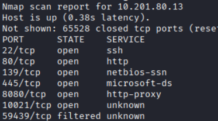
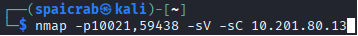
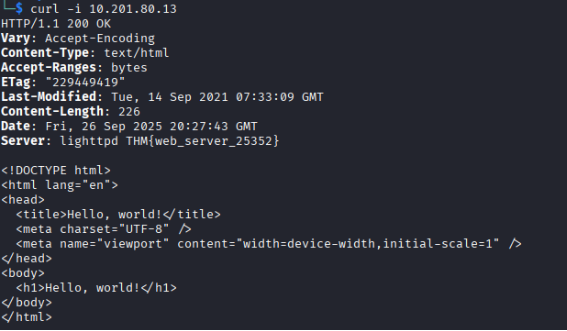
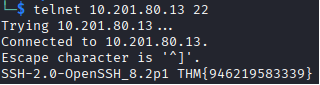
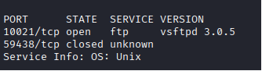
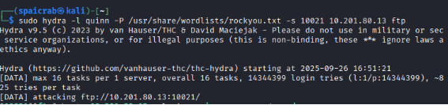
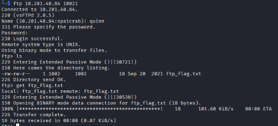
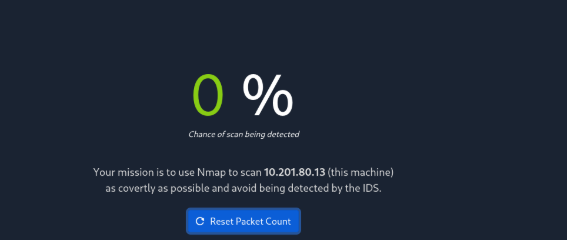
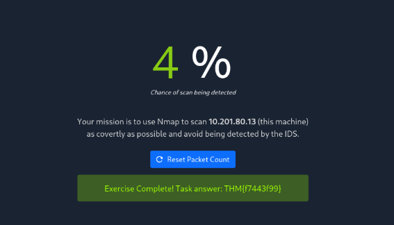

**Maquina Net Sec Challenge, TryHackMe**

Esta máquina de TryHackme esta mas orientada a principiantes, no solo debido a que se necesitan solo 3 herramientas (Nmap, Telnet y Hydra) si no que para completar la maquina hay que ir respondiendo preguntas en la página web mientras se avanza y asi poder completarla a diferencia de un CTF normal en donde para completar la maquina se necesitan las flags de usuario y root

Primero se hace un escaneo típico en nmap para ver toda la información posible de la maquina y sus puertos abiertos, pero esta vez se requiere escanear los 65 535 puertos con el parámetro “-p-“ en nmap debido a que se necesita para responder 2 preguntas para avanzar en la habitación.

**¿Cuál es el numero de puerto mas alto por debajo de 10 000?**

R/ 8080

**Hay un puerto abierto fuera de los 1000 puertos comunes, esta por encima de 10 000. ¿Cuál es?**

R/10021

**¿Cuántos puertos TCP están abiertos?**

R/ 6

Antes de seguir avanzado se deja escaneando en otra ventana los puertos encontrados con servicios desconocidos para tener más detalles al respecto.

**¿Cuál es la flag escondida en el header del servidor HTTP?**

En el escaneo de nmap se encontró un puerto 80 http, para encontrar la respuesta a esta pregunta se hace un “curl -i” para el contenido del header, encontrado asi la flag requerida para responder la pregunta, de igual forma se puede conseguir el mismo resultado analizando el puerto con nmap.

**¿Cuál es la flag escondida en el header del servidor SSH?**

 

Para conseguir esta flag solo se necesita conectarse al puerto 22 con telnet, también se puede lograr lo mismo analizando el puerto con nmap

**Hay un servidor FTP escuchando en un puerto no estándar, ¿Cuál es la versión de ese puerto?**

** 

Estos serian los resultados del escaneo que se dejó realizando en otra ventana y asi dando la versión del puerto FTP

Para poder seguir avanzando en la maquina se necesita entrar al servidor ftp y encontrar la flag para responder la pregunta, la habitación de la maquina ya proporciona 2 nombres de usuario, “eddie” y “quinn”, ahora solo se necesita conseguir las contraseñas de alguna de las 2 cuentas.

Se utiliza hydra para hacer un ataque de fuerza bruta, en este caso al usuario quinn, rockyou.txt debería ser suficiente para esta máquina, se tiene que utilizar el parámetro “-s” para especificar el puerto debido a que el servicio FTP se encuentra en el puerto 10021, si no esta especificado en el comando, hydra no funcionara, el ataque debería realizarse sin ningún problema consiguiendo la contraseña de quinn.

Al conectarse al servidor FTP con las credenciales encontradas se puede ver que esta cuenta es la que tiene la flag para avanzar en la maquina

**Al navegar al [**http://IP:8080**](http://IP:8080) hay un pequeño desafío, ¿Cuál es la flag que muestra al completarlo?**

Para conseguir la flag de la ultima pregunta se tiene que completar el desafío que dice la página, en este caso se busca que el usuario haga un escaneo en nmap de la forma mas sigilosa posible, para lograr esto se puede utilizar escaneos de tipo FIN o NULL

Al hacer el escaneo la pagina cambia y da la flag necesaria para completar la máquina.
