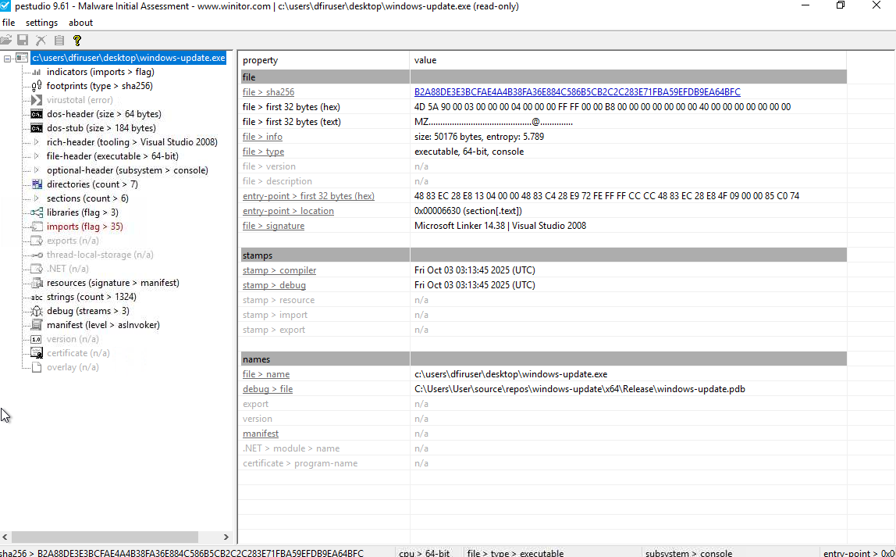
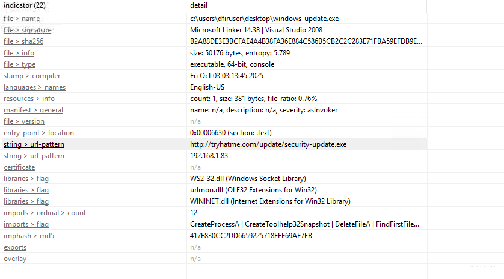
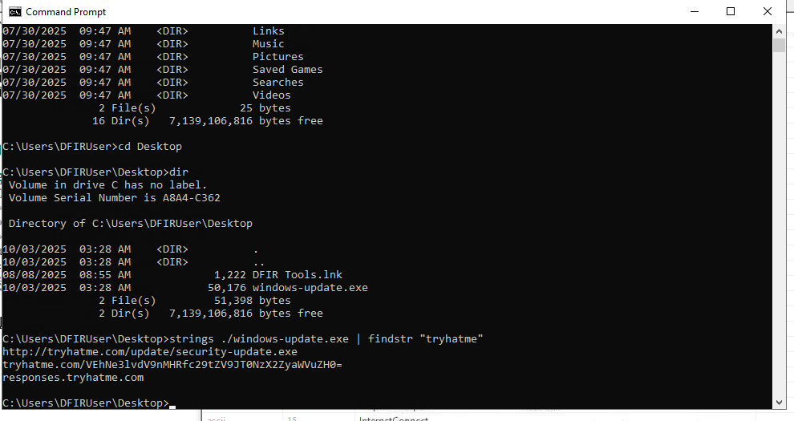
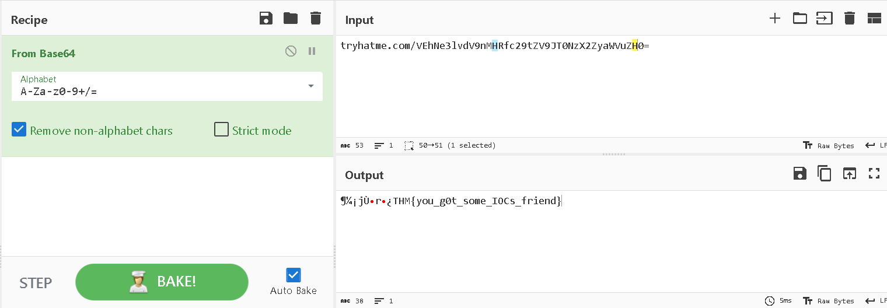
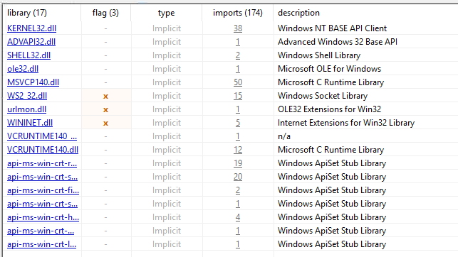
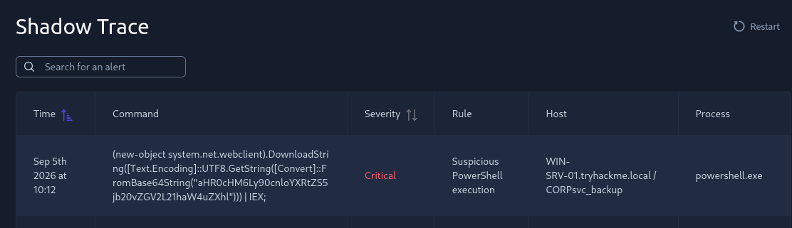
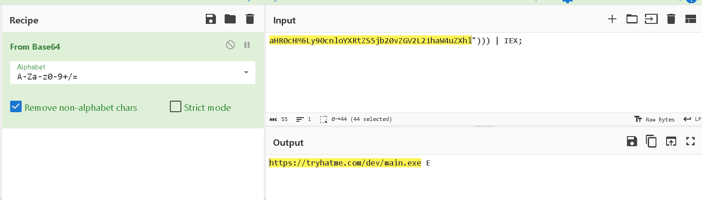
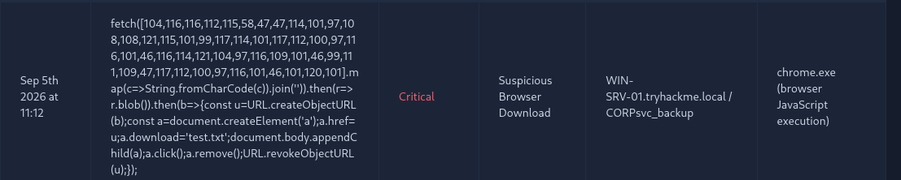
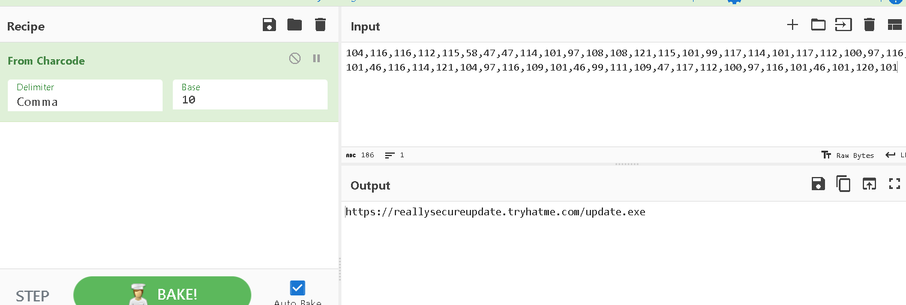

En esta maquina sobre BLUE Team en ciberseguridad, se va a analizar un archivo malicioso, con todo lo aprendido en análisis estáticos y dinámicos y tipos de malware en habitaciones anteriores de TryHackme, se analizara el archivo para responder las preguntas y completar la maquina.

## Análisis de archivo

Primero, para analizar un malware, se hace un análisis estático para sacar información básica del archivo, para esto se usara Pestudio que ya viene en la maquina de la habitación, el cual es una herramienta de análisis estático que examina archivos ejecutables de Windows como `.exe` o `.dll` para detectar signos tempranos de comportamiento malicioso o sospechoso sin necesidad de ejecutar el archivo.

Al poner el archivo malicioso en la herramienta, se consigue información para responder a las dos primeras preguntas de la habitación.

Cual es la arquitectura del archivo binario de windows-update.exe?
- 64-bit

Cual es el hash sha-256 del archivo windows-update.exe?
- b2a88de3e3bcfae4a4b38fa36e884c586b5cb2c2c283e71fba59efdb9ea64bfc 

Dentro de la sección "imports" de Pe Studio se encuentra una URL sospechosa, esta misma URL puede indicar varias actividades sospechosas como exfiltración de datos, descarga adicional de malware, etc. En un caso real, toda URL o IP sospechosa dentro  del binario debería ser investigada y bloqueada inmediatamente si se confirma cualquier actividad maliciosa.

Identifica la URL para usar como IOC
- hxxp[://]tryhatme[.]com/update/security-update[.]exe

La siguiente pregunta pide encontrar un dominio que puede ser usado como IOC, parece ser que tryhatme es un second-level domain o SLD, entonces lo que se esta buscando es un subdominio, para encontrar esta URL se puede hacer de dos formas:

Usando la sección strings en Pe Studio pero esta sección cuenta con mucha información innecesaria que podría dificultar la búsqueda de esta URL, entonces un enfoque mas directo es utilizar el comando strings en el archivo binario con findstr y tryhatme como parametro, asi encontrando cualquier string relacionado o similar a tryhatme.

Cual es el dominio que puede ser usado como IOC?
- responses[.]tryhatme[.]com

Ademas, en lo mostrado en la terminal también se encuentra un resultado interesante, tryhatme y un codigo en base64, al poner ese codigo en cyberchef de FromBase64, se encuentra una flag para responder a la siguiente pregunta

Ingresa la flag decodificada del dominio sospechoso
- THM{you_g0t_some_IOCs_friend}

En la ultima pregunta de la sección de análisis de archivo, se pide encontrar la librería relacionada a la comunicación socket cargada en el binario, para esto solo hay que dirigirse a la sección "libraries" de Pe Studio, en la que se encuentra WS2_32.dll marcada como Windows Socket Library.

Que librería esta relacionada a la comunicación socket en el binario cargado?
- WS2_32.dll

## Análisis de Alertas

En la siguiente sección de la maquina hay que analizar alertas provocadas por el binario, la primera pregunta pide identificar la URL maliciosa activada del proceso powershell.exe, al ver el comando en la alerta se encuentra un codigo en base64, al decodificar ese codigo en cyberchef, se encuentra la URL

Identifica la URL maliciosa disparada por el proceso powershell.exe
- hxxps[://]tryhatme[.]com/dev/main[.]exe

La siguiente pregunta es similar, ahora pide identificar la URL maliciosa actividad por chrome.exe, al ver el comando que provoco la alerta, se ve que esta codificado en charcode, en esta codificación consiste en obtener el valor numérico único o código Unicode de un carácter específico dentro de una cadena de texto, al poner dicho codigo en cyberchef con los parámetros Delimetter en Comma y Base10, se obtiene la URL maliciosa

Identificar la URL maliciosa disparada por el proceso chrome.exe
- hxxps[://]reallysecureupdate[.]tryhatme[.]com/update[.]exe

Dentro del comando de la alerta, se puede leer que se descargo un archivo llamado test.txt, siendo esta la ultima respuesta de la ultima pregunta completando asi la maquina Shadow Trace

Cual es el nombre del archivo salvado por la alerta disparada del proceso chrome.exe?
- Test.exe

En conclusión, El análisis estático y de alertas realizado sobre el binario `windows-update.exe` en la máquina **Shadow Trace** permitió identificar los principales Indicadores de Compromiso (IOCs) y comprender el comportamiento básico de la amenaza sin necesidad de ejecutarla.

A través de **Pestudio** y comandos de consola como `strings`, se determinaron la arquitectura binaria (64-bit), la firma del archivo (SHA-256), la carga de la librería `WS2_32.dll` para comunicaciones por socket, y dominios/URLs sospechosos vinculados con potencial descarga de malware o exfiltración de datos. de igual forma, la decodificación de parámetros en Base64 reveló artefactos ocultos y la flag de la maquina.

En la fase de análisis de alertas, el uso de **CyberChef** fue clave para desofuscar payloads codificados en Base64 y Charcode, revelando las URLs maliciosas asociadas a la ejecución de procesos legítimos como `powershell.exe` y `chrome.exe`, además de identificar el archivo descargado `Test.exe`.